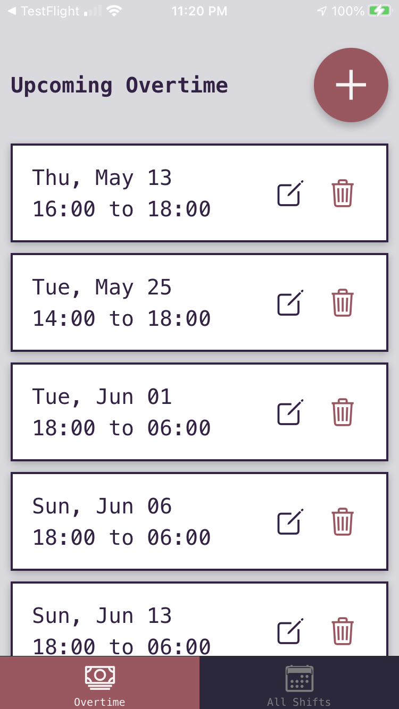
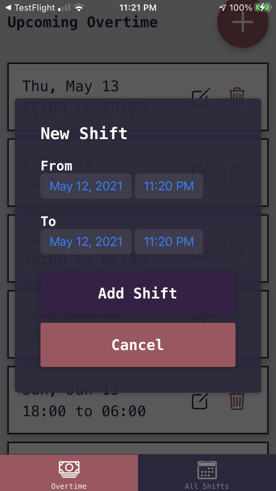
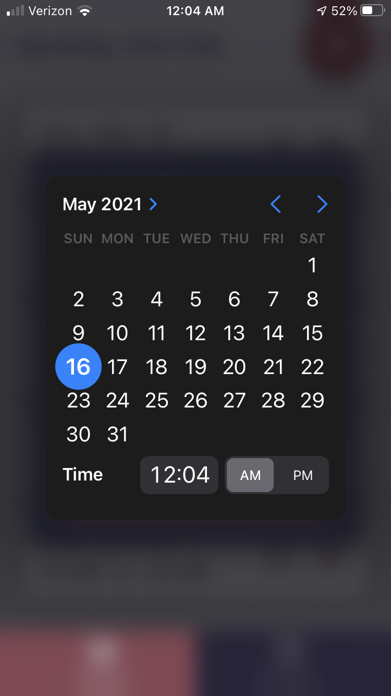
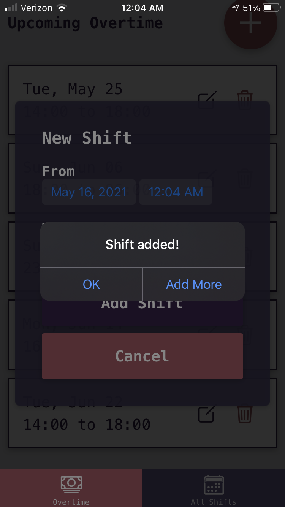
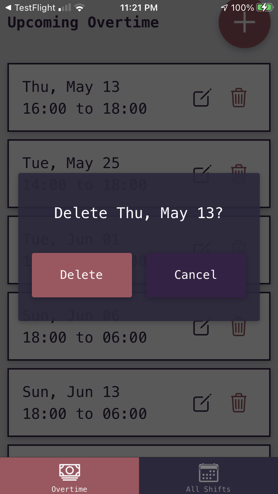
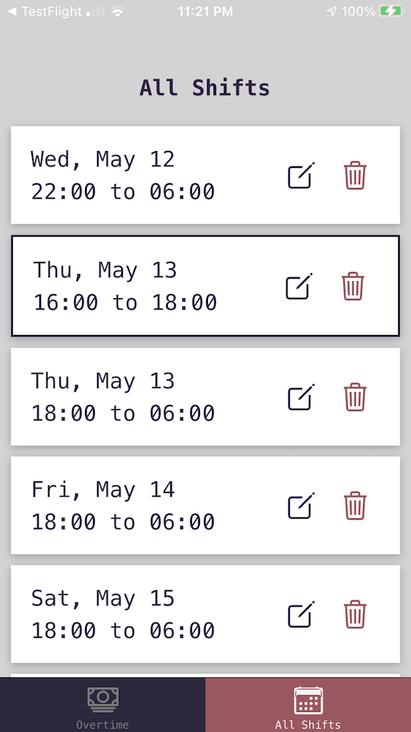
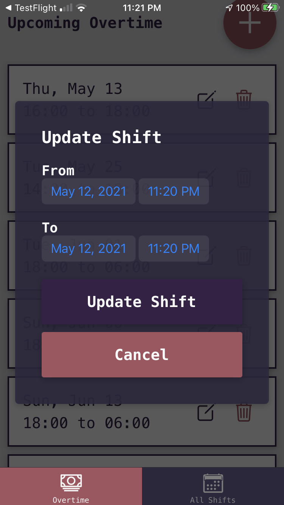

# Overtime Tracker

---

## Overview

While not working my butt off towards a software gig, I work (much more than) full-time as a 9-1-1 Dispatcher. Due to the horrendous amount of overtime, I've become tired of wading through all of my calendar's events to see when I'm working week to week. I spun up this little app using React Native, TypeScript, and different aspects of the Expo calendar API.

Functionality includes adding, updating and deleting shifts from the calendar. The native iOS calendar app is immediately updated with the provided information.

---

## Tech

| Core         | Libraries                             | Tests               |
| ------------ | ------------------------------------- | ------------------- |
| TypeScript   | Expo-Calendar                         | Jest                |
| React Native | React Navigation                      | React Test Renderer |
| Expo         | React Native Community Datetimepicker | JavaScript          |

---

## Screenshots

